# Real-Time Dance Guide System

An AI-powered web application that enables users to learn, practice, and evaluate dance movements using real-time feedback, motion analysis, and LLM-based interpretation.

---

## Introduction

The Real-Time Dance Guide System is designed to make dance learning accessible, structured, and interactive. Traditional dance training often requires physical instructors and is not accessible to everyone. Existing online resources provide video content but lack personalized feedback.

This system bridges that gap using computer vision, deep learning, and Large Language Models (LLMs).

---

## System Architecture

  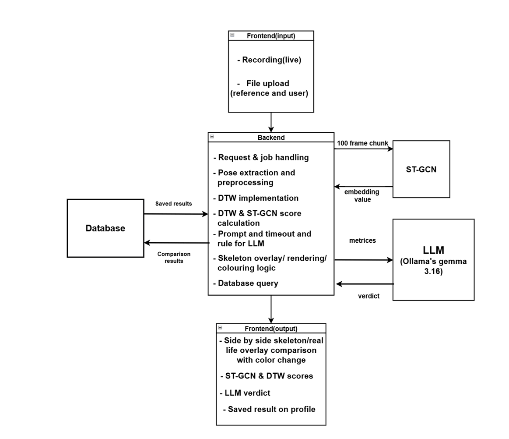

The system processes video input, extracts pose keypoints, analyzes motion using DTW and ST-GCN, and generates feedback using an LLM layer.

---

## Application Interface

### Practice Mode

  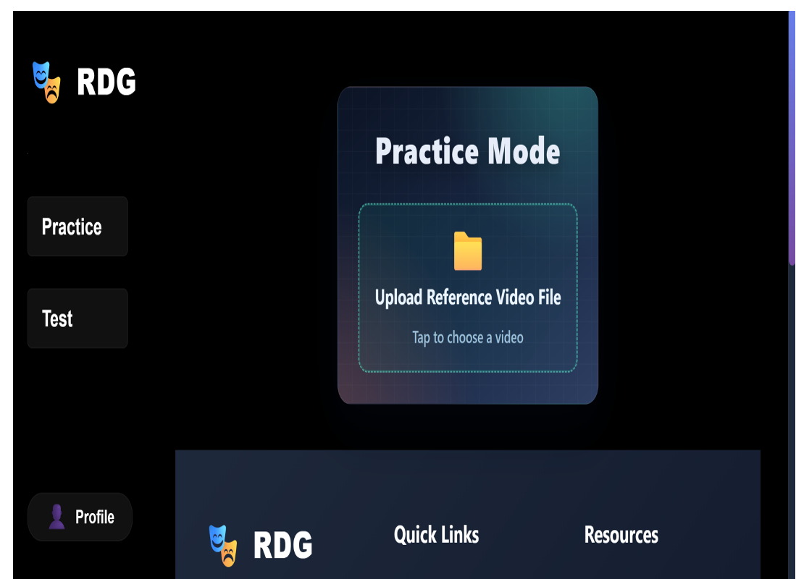

- Guided step-by-step dance learning  
- Side-by-side comparison  
- Slow motion support  
- Real-time pose tracking  

---

### Test Mode

  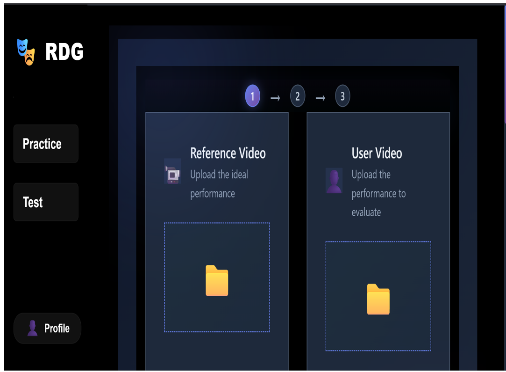

- Full performance recording or upload  
- Automated scoring  
- Detailed feedback generation  

---

### Live Pose Overlay

  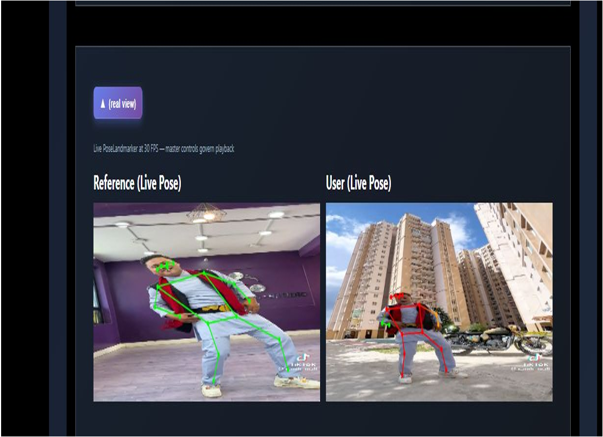

- Real-time skeleton tracking  
- Visual correction guidance  

---

### Skeleton Representation

  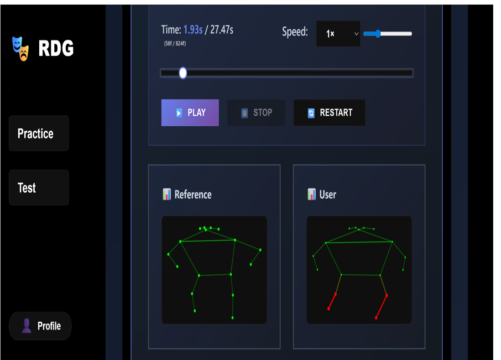

Based on COCO-17 keypoint structure:

  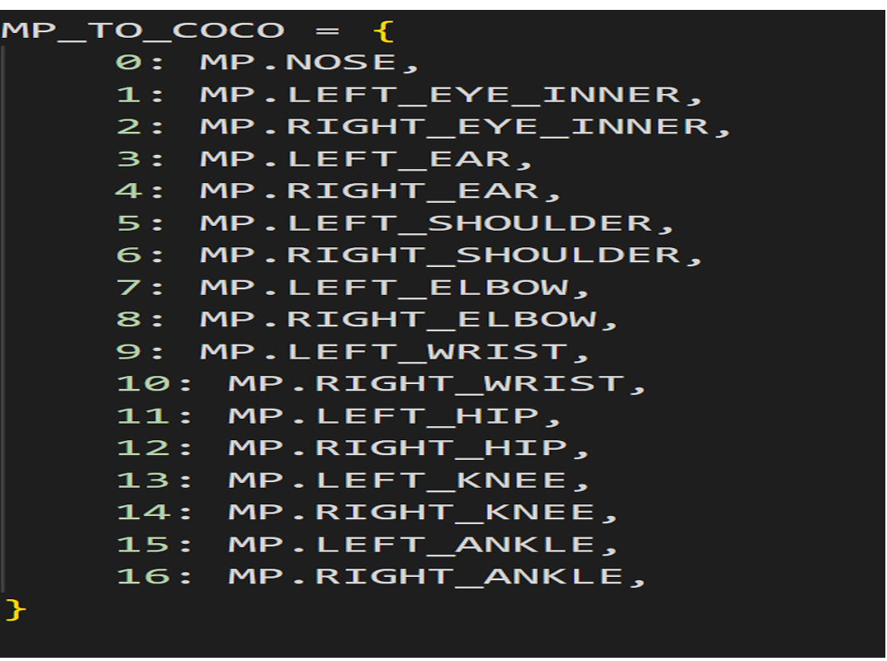

---

## AI and Model Performance

### Training and Validation Loss

  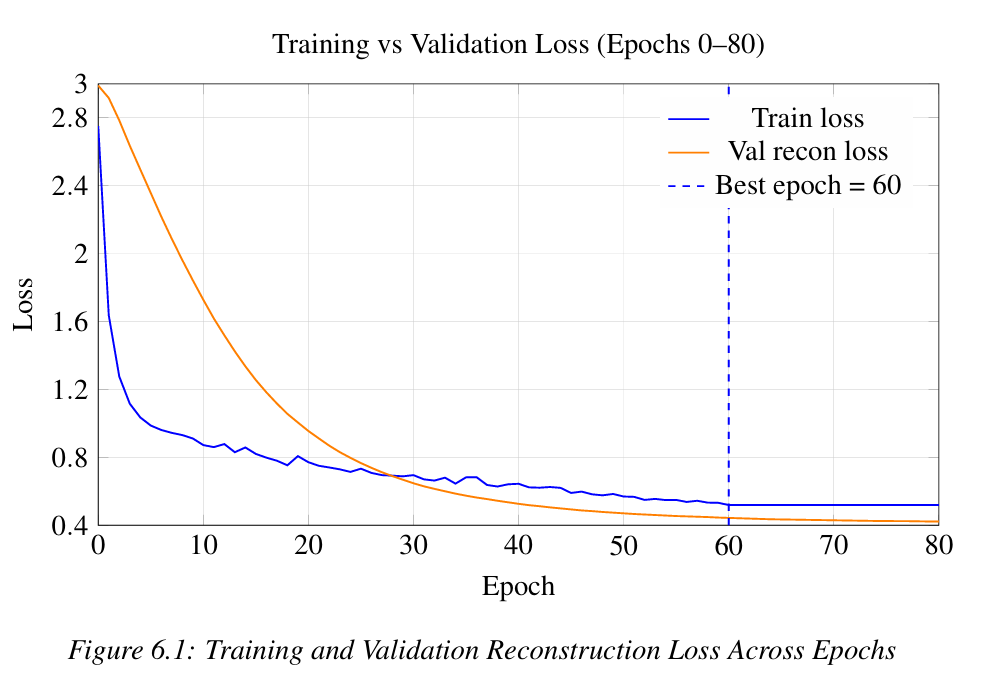

### Learning Rate Schedule

  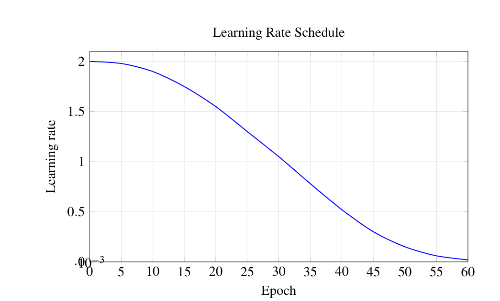

### Generalization Gap

  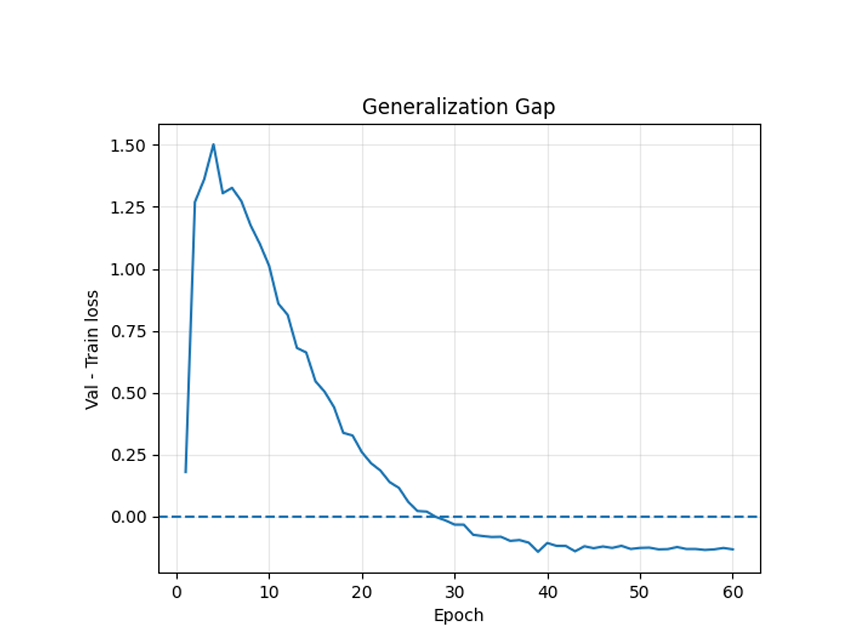

---

## Performance Analysis

### Model Score Output

  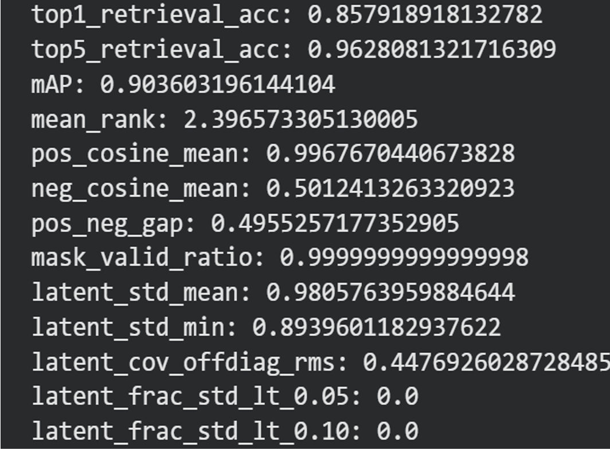

### Final Scores Visualization

  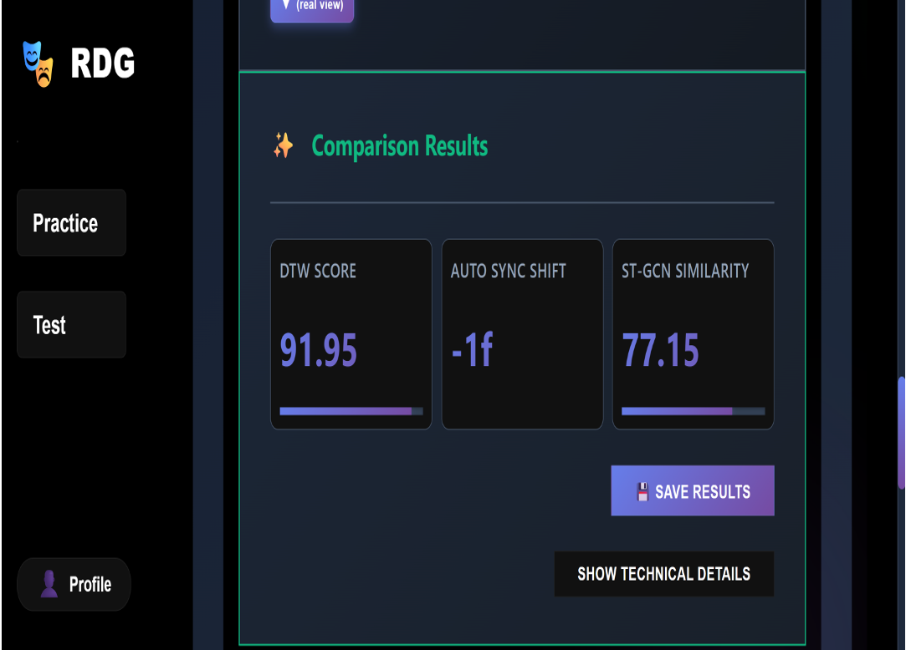

### Score Behavior with Distance

  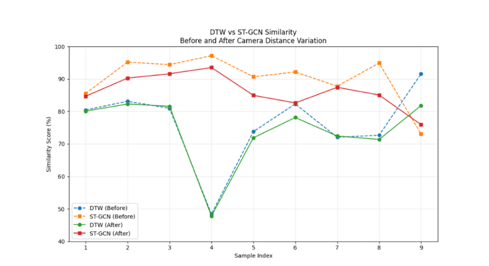

---

## LLM-Based Feedback

  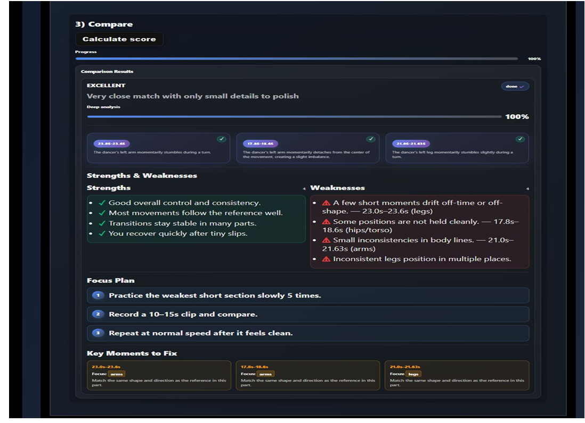

The system uses a Large Language Model to convert numerical evaluation metrics into human-readable feedback.

- Explains mistakes clearly  
- Suggests improvements  
- Provides overall performance summary  

---

## User Profile

  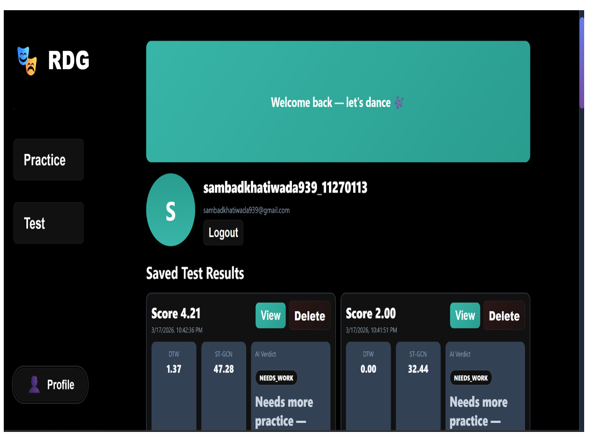

---

## How It Works

1. User inputs video via webcam or upload  
2. Frames are extracted and processed  
3. Pose keypoints are detected using MediaPipe  
4. Keypoints are normalized  
5. Motion comparison is performed using:
   - Dynamic Time Warping (DTW)  
   - ST-GCN  
6. Metrics are generated  
7. LLM interprets results  
8. Feedback and scores are displayed  

---

## Tech Stack

**Frontend**
- React.js  
- HTML, CSS, JavaScript  

**Backend**
- Django  
- Django REST Framework  

**Machine Learning**
- MediaPipe  
- ST-GCN  
- Dynamic Time Warping  
- Cosine Similarity  
- Euclidean Distance  

**LLM**
- Gemma (via Ollama)  

**Tools**
- OpenCV  
- Firebase  
- Python  

---

## Setup Instructions
git clone https://github.com/sambad-K/Realtime_Dance_Guide_System  
cd Model_Backend  
python -m venv venv  
Windows: venv\Scripts\activate  
pip install -r requirements.txt  
python manage.py migrate  
python manage.py runserver  

### Frontend Setup
cd UI_Auth_Routing
npm install  
npm run dev 

---

## Applications

- Dance learning platforms  
- Fitness training systems  
- Content creation tools  
- Educational AI systems  

---

## Future Improvements

- Multi-person tracking  
- Mobile app support  
- Faster real-time inference  
- Advanced pose models  
- Improved LLM personalization  

---

---
##Contact
Email: sambadkhatiwada939@gmail.com
Linkedin:https://www.linkedin.com/in/sambad-khatiwada/
Github: https://github.com/sambad-K/
---
## License

Academic project, can be extended for production use.
